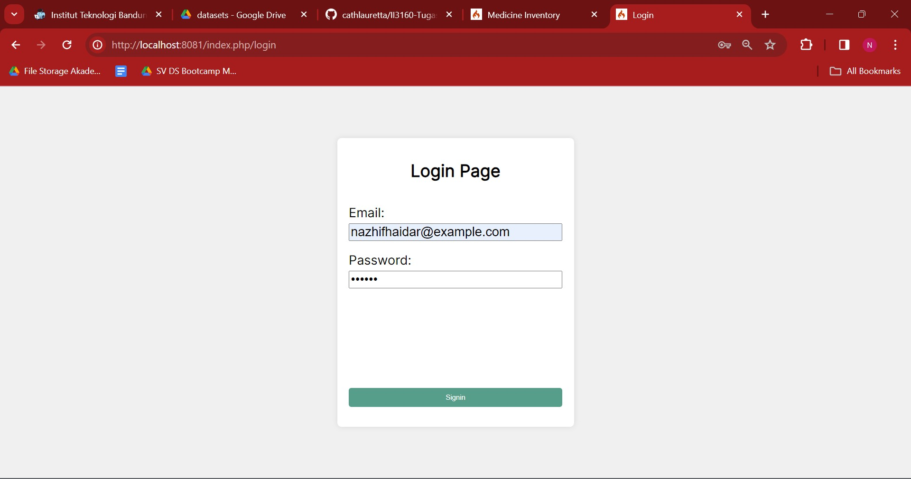
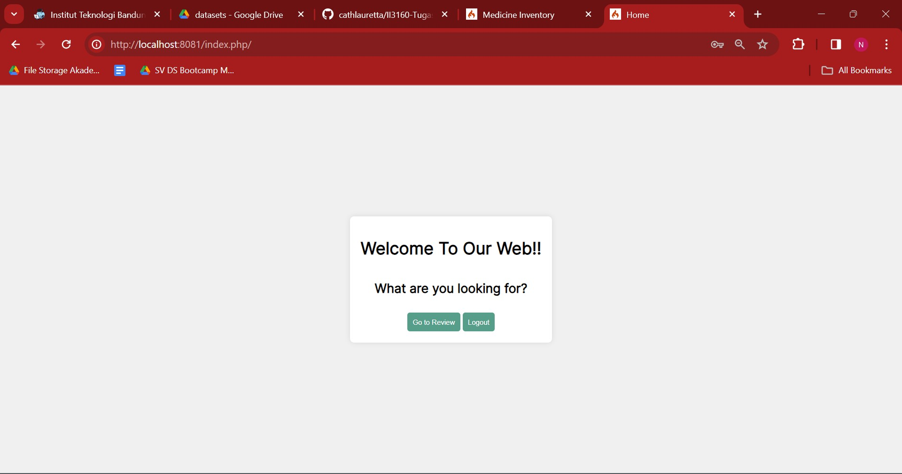
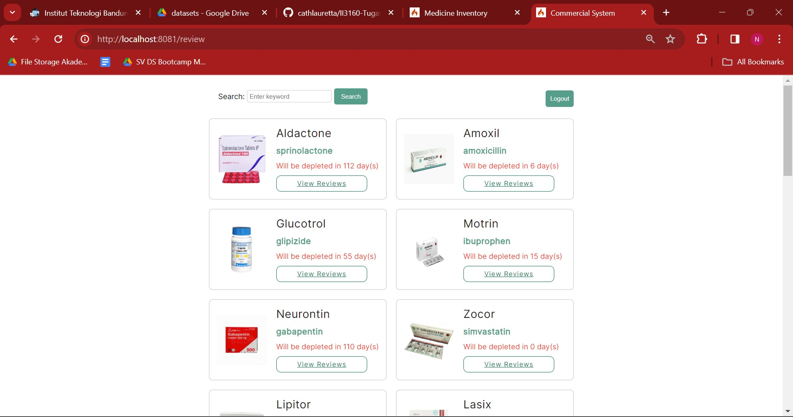
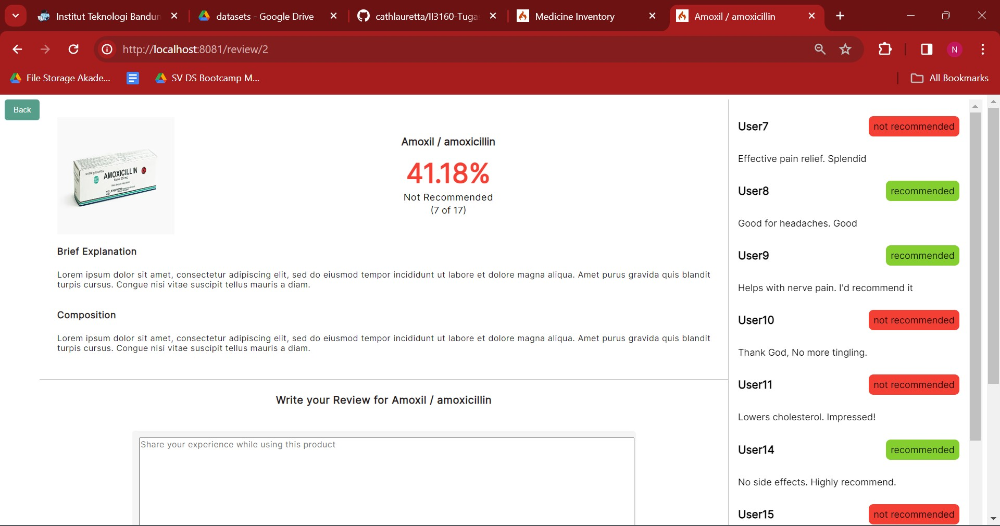

# Pharmacy - Product Review System
## Tugas Besar II3160 Teknologi Sistem Terintegrasi
Product Review System is a system used to add some medicine products reviews. This system uses an API from [Medicine Inventory Management System](https://github.com/cathlauretta/II3160-pharmacy-inventory) to show how much days left until a product needs to be restocked.

## Table of Contents
- [Requirements](#requirements)
- [How to Run the Program](#how-to-run-the-program)
- [Program Usage Guide](#program-usage-guide)
- [Authors](#authors)

## Requirements
- [CodeIgniter4](https://github.com/codeigniter4/CodeIgniter4)
- [XAMPP](https://www.apachefriends.org/)
- Code Editor, such as [Visual Studio Code](https://code.visualstudio.com/download)

## How to Run the Program
1. Clone this repository
    ```bash
    git clone https://github.com/cathlauretta/II3160-pharmacy-review.git
    ```

2. Change directory to the cloned repository
    ```bash
    cd II3160-pharmacy-review
    ```

3. Install the required dependencies
    ```bash
    php composer.phar install
    ```

4. Open http://localhost/phpmyadmin/ and insert the `review.sql` to the database

5. Adjust the `env.example` to your environment configuration

6. Run this command and open http://localhost:8081/
    ```bash
    php spark serve --port 8081
    ```

## Program Usage Guide
User must do login first to access the system. You can use the dummy account from our sql


This is our landing page where user can choose between Review and Logout


Review menu consist of medicines that can be reviewed by user.


If user choose 'View Review' user can see another review by other users and user can also input their own experience and review while using the product. This system uses an NLP model to predict whether a review is recommended.


## Author
| Student ID | Name |
|---|---|
| 18221053 | Laurentia Kayleen Christopher |
| 18221083 | Nazhif Haidar Putra Wibowo |
| 18221157 | Cathleen Lauretta |